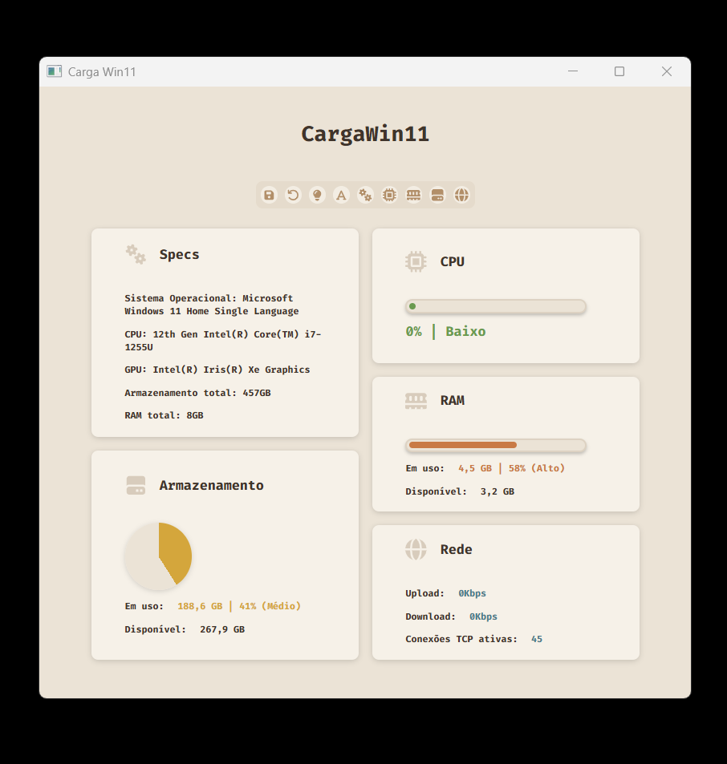
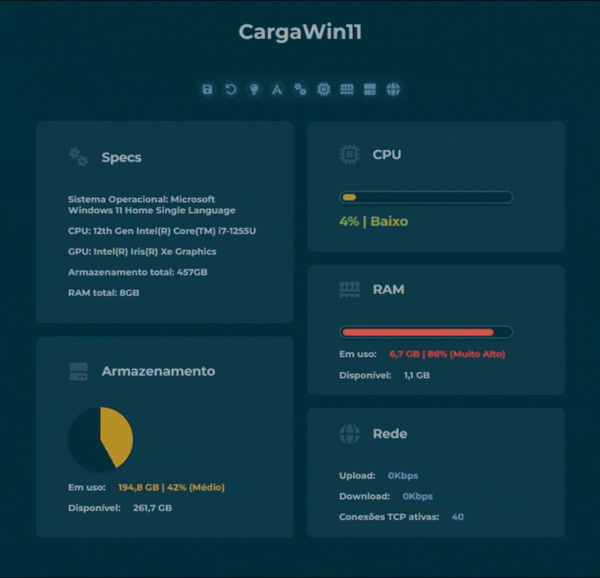
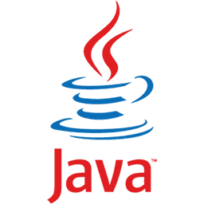
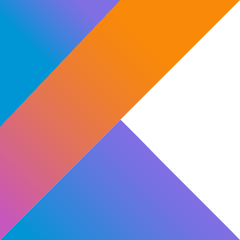
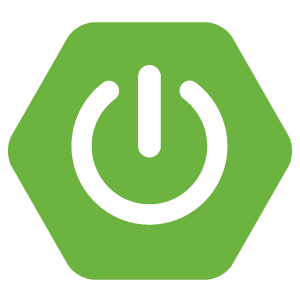
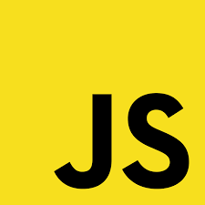
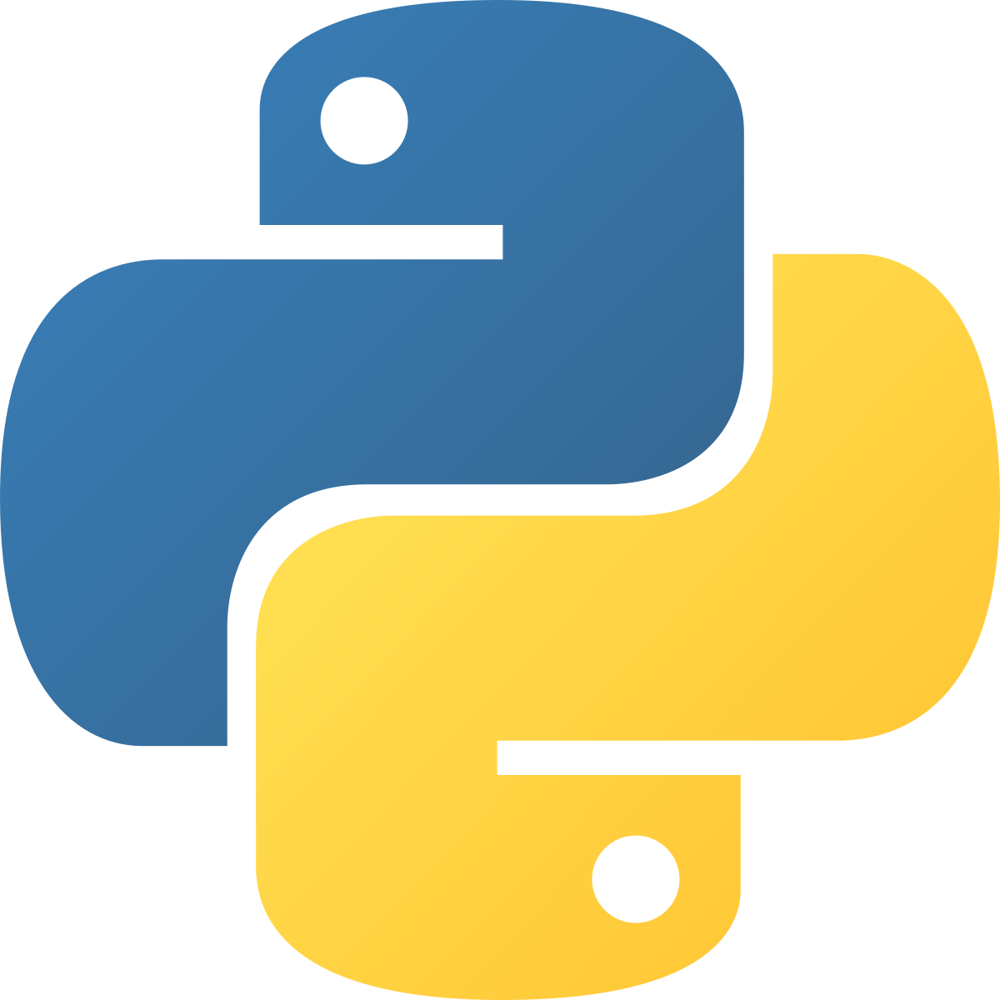

<h1>Projetos em destaque</h1>

<h2>📊 CargaWin11 (Desktop)</h2>

  
  

  <strong>Sobre:</strong> Aplicação nativa/híbrida para Windows 11 a qual exibe informações em tempo real sobre CPU, memória RAM, armazenamento e rede por meio de uma interface gráfica dinâmica, moderna e personalizável. O usuário pode escolher entre diferentes temas de cores e fontes, além de definir quais cards de informações deseja visualizar no dashboard.

  <strong>Stack:</strong> .NET, C#, Blazor Hybrid, HTML, CSS e JavaScript.

  <strong>Link:</strong>
  <a href="https://github.com/jef-nunes/CargaWin11">Repositório</a>

  

<h2>✨ Açaíteria Gourmet (Frontend)</h2>

  

  <strong>Sobre:</strong> Frontend institucional para uma loja de açaí gourmet.

  <strong>Stack:</strong> HTML, CSS e JavaScript.

  <strong>Link:</strong>
  <a href="https://github.com/jef-nunes/frontend-acaiteria-gourmet">Repositório</a>

  

<h2>🌎 Projeto Eco (Backend)</h2>

  <strong>Sobre:</strong> Backend para um site sobre desastres naturais e meio ambiente. É composto pela API REST do sistema e o seu banco de dados relacional.

  <strong>Stack:</strong> Java, Spring Boot e MySQL.

  <strong>Link:</strong>
  <a href="https://github.com/jef-nunes/backend-projeto-eco">Repositório</a>

  

<h3>🛠️ Loja de Materiais (Banco de Dados)</h3>

  <strong>Sobre:</strong> Modelagem de dados completa para um sistema de controle de estoque de uma loja de materiais de construção.

  <strong>Stack:</strong> MySQL.

  <strong>Link:</strong>
  <a href="https://github.com/jef-nunes/materiais-db">Repositório</a>

  

<!--h1>Skills</h1>

  
  
  
  
  
  
  
  
  
  
  
  
</p-->
